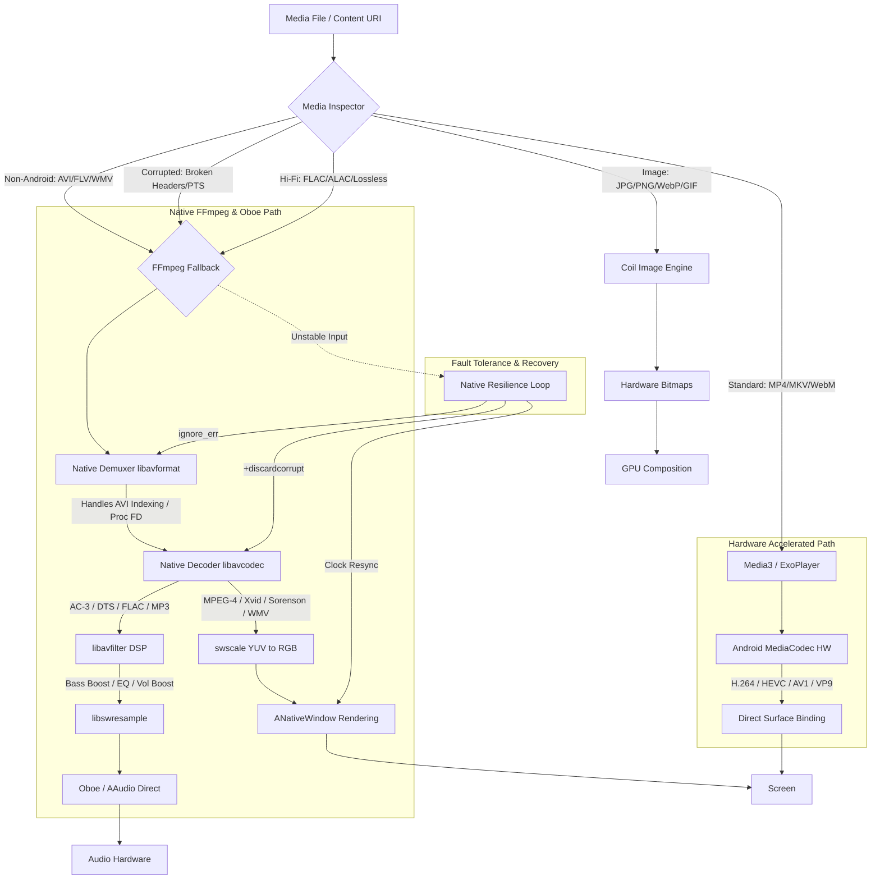

# MediaNest ▶▶
### Universal Media Viewer & Gallery for Android

MediaNest is a high-performance, feature-rich media management application designed for seamless local media playback and organization. Built with a "Hardware-First" philosophy, it leverages modern Android APIs to provide a zero-copy, privacy-focused experience.

---

## 🌟 Key Features

- **Unified Library:** A single hub for all your Images, Videos, and Audio files.
- **Quick View:** Rapid media previewing without leaving your context.
- **Custom Categorization:** Organize videos and images into custom collections and categories.
- **Advanced Playback:**
  - **Video:** Supports H.264, HEVC, AV1, and VP9 with hardware SoC DSP decoding.
  - **Audio:** High-fidelity playback using AAudio and OpenSL ES with lyrics and metadata support.
- **Security & Privacy:**
  - **App Lock:** Secure your library with a PIN.
  - **Hidden Folders:** Mask specific directories from the media scanner.
  - **Stealth Mode:** Content protection in the "Recent Apps" screen using `FLAG_SECURE`.
- **Media Analytics:** Deep insights into your media formats, storage usage, and playback history.
- **Hardware Acceleration Engine:** Proprietary subsystem for zero-copy rendering, adaptive memory management, and GPU-accelerated UI.

---

## 🛠️ Tech Stack

- **UI:** [Jetpack Compose](https://developer.android.com/jetpack/compose) with [Material 3](https://m3.material.io/)
- **Media Engine:** [Android Media3 (ExoPlayer)](https://developer.android.com/guide/topics/media/media3)
- **Database:** [Room Persistence Library](https://developer.android.com/training/data-storage/room)
- **Preferences:** [Jetpack DataStore](https://developer.android.com/topic/libraries/architecture/datastore)
- **Image Loading:** [Coil](https://coil-kt.github.io/coil/) with Hardware Bitmaps enabled
- **Language:** 100% [Kotlin](https://kotlinlang.org/)
---

## 🚀 Hardware Optimization & Architecture

MediaNest implements a sophisticated, multi-engine pipeline to ensure high-performance playback and broad format compatibility.

### Media Flow Architecture

### Engine Selection Matrix

| Media Type | Formats / Codecs | Why Fallback? | Decoding Engine | Rendering Path |
| :--- | :--- | :--- | :--- | :--- |
| **Standard Video** | MP4, MKV, WebM (H.264, HEVC, AV1) | Native Support | **Media3 (HW)** | MediaCodec -> Surface |
| **Non-Native Video**| **AVI, FLV, WMV** (Xvid, DivX, Sorenson) | Missing HW Decoders | **FFmpeg (SW)** | swscale -> NativeWindow |
| **Corrupted Video** | **Damaged Headers, Invalid PTS** | Media3 Stalls/Crashes | **FFmpeg (Resilient)** | Fault-Tolerant Loop |
| **Lossless Audio** | **FLAC, ALAC, WAV, DTS, AC-3** | Bit-Perfect / DSP | **FFmpeg (Native)** | Oboe (Direct HW Access) |
| **Standard Audio** | MP3, AAC | System Default | **Media3** | System Mixer |
| **Images** | JPG, PNG, WEBP, SVG, GIF | Zero-Copy | **Coil** | Hardware Bitmaps |

### Fault Tolerance & Resilience
- **Native Recovery**: The FFmpeg loop uses `+discardcorrupt` and `ignore_err` flags to bypass damaged frames.
- **Clock Synchronization**: The master clock is slaved to Oboe's hardware clock. If video timestamps drift by more than 500ms, a sub-millisecond resync occurs to prevent hangs.
- **Memory Safety**: Uses direct File Descriptors (`/proc/self/fd/`) to avoid memory-heavy file copying during native probing.

### Format & Preferred Path Routing(Video)

| File / Stream Condition | Preferred Path | How MediaNest Handles It |
| :--- | :--- | :--- |
| **MP4 + H.264** | **Media3 → hardware** | Evaluated clean by `MediaCapabilityInspector` → routed to `Media3PlaybackEngine` / `ExoPlayer` using Android `MediaCodec` hardware acceleration. |
| **MKV + H.265** | **Media3 → hardware** | Evaluated clean by `MediaCapabilityInspector` → routed to `Media3PlaybackEngine`. |
| **WebM + VP9** | **Media3 → hardware** | Evaluated clean by `MediaCapabilityInspector` → routed to `Media3PlaybackEngine`. |
| **AVI + Xvid** | **FFmpeg** | `MediaCapabilityInspector` probes format as `AVI` + `MPEG-4/XVID` → forces `requiresFFmpegFallback = true` → routes to `FFmpegPlaybackEngine`. |
| **AVI + unusual MPEG-4** | **FFmpeg** | Probed as `AVI` / `msmpeg4` / `mpeg4` → routed to `FFmpegPlaybackEngine`. |
| **FLV + old codec** | **FFmpeg** | Probed as `FLV` container or video codec containing `flv` → routed to `FFmpegPlaybackEngine`. |
| **MPEG-TS + unusual stream** | **FFmpeg** | Evaluated or fallen back to `FFmpegPlaybackEngine`. |
| **Unsupported Android codec / Container** | **FFmpeg** | `DefaultRenderersFactory.setEnableDecoderFallback(true)` in Media3 attempts software fallback first; if Media3 fails to demux/decode, it automatically switches to `FFmpegPlaybackEngine`. |

---

### Fault Tolerance & Error Recovery Strategies (FFmpeg Engine)

| Fault / Corruption Scenario | Recovery Behavior in `FFmpegPlaybackEngine` (`ffmpeg_jni.cpp`) |
| :--- | :--- |
| **Broken timestamps** | Monotonic clock derivation via stream time bases (`AV_NOPTS_VALUE` checks) & frame rates. Recovers timestamps without dropping playback. |
| **Corrupt video packets** | Catches `AVERROR_INVALIDDATA` / decode errors, flushes/resets video decoders if required, skips bad frames/packets, and resumes decoding on next decodable frame/keyframe. |
| **Corrupt audio packets** | Catches corrupt frames (e.g. AC-3 `expacc out-of-range`), logs error, increments `audioDecodeErrors` counter, skips corrupted packet, and continues decoding valid subsequent frames without stopping video. |
| **A/V Desynchronization** | Audio (via Oboe) and Video (via `ANativeWindow`) maintain independent error recovery loops, resynchronizing with the master playback clock. |

---

## 🚀 Hardware Features Details

---

## 📂 Project Structure

- `app/src/main/java/com/medianest/ui/`: Compose screens and components.
- `app/src/main/java/com/medianest/data/`: Repositories and Room DB definitions.
- `app/src/main/java/com/medianest/player/`: ExoPlayer lifecycle and state management.
- `app/src/main/java/com/medianest/hardware/`: Hardware capability detection and optimization logic.

---

## 🛠️ Run Locally

**Prerequisites:** [Android Studio](https://developer.android.com/studio)

1. **Clone & Open:** Open the project directory in Android Studio.
2. **Configuration:** Ensure your environment is set up according to Android Studio requirements.
3. **Deploy:** Run the app on an emulator or physical device.

---

## 🛡️ Privacy & Security

**100% Local Processing.** All media decoding, indexing, and UI rendering happen strictly on your device. MediaNest does not upload your personal media to any cloud services.

---

## 📱 Device Support & Build Variants

MediaNest uses **ABI Splits** to keep the application size small while providing native FFmpeg support. When building or downloading, choose the variant that matches your device:

- **`arm64-v8a` (Modern Standard):** Recommended for almost all Android devices released in the last 5-7 years (e.g., Pixel 4-9, Samsung S10-S24). Offers the best performance for native decoding.
- **`armeabi-v7a` (Legacy):** Suitability for older 32-bit ARM devices or budget entry-level phones (pre-2017 hardware).
- **`x86_64` (Emulators/Laptops):** Optimized for Android Emulators (running on Mac/Windows) and Intel-based Chromebooks or tablets.
- **`Universal APK` (One-Size-Fits-All):** Contains native code for all architectures. Larger file size (~90MB vs ~25MB), but compatible with any device.

