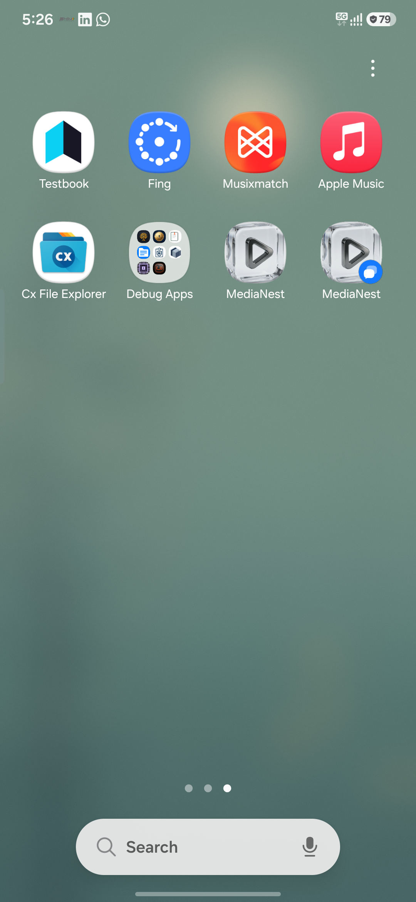

# MediaNest ▶▶

### High-Performance Universal Media Gallery for Android

MediaNest is a hardware-optimized media management application designed for seamless local media playback and organization. Built with a **"Hardware-First"** philosophy, it leverages zero-copy rendering and a hybrid playback engine to deliver an elite media experience on any Android device.

---

## 🌟 Core Pillars

### 🚀 Performance & Hardware
- **Hybrid Engine**: Native SoC DSP decoding (Media3) with high-fidelity FFmpeg fallback.
- **Zero-Copy Pipeline**: Direct surface binding avoids expensive CPU-side memory copies.
- **Gigapixel Support**: Seamlessly render ultra-high-resolution images using sub-region tile rendering.
- **Adaptive Memory**: Dynamic RAM & VRAM scaling for devices ranging from 2GB to 64GB+.

### 🛡️ Security & Privacy
- **100% Local**: No cloud dependencies. All indexing and processing happen on-device.
- **Privacy Suite**: App Lock (PIN/Biometric), Stealth Mode, and Hidden Folder support.

### 🎨 Elite User Experience
- **Glassmorphic UI**: High-performance "Ambient" surfaces and fluid liquid animations.
- **Unified Library**: Seamlessly browse Images, Videos, and Audio in a single hub.
- **Deep Analytics & DSP**: Pro-audio 5-band equalizer, visualizers, and detailed format insights.

---

## 🛠️ Tech Stack

| Layer | Technology |
| :--- | :--- |
| **UI** | [Jetpack Compose](https://developer.android.com/jetpack/compose) + [Material 3](https://m3.material.io/) |
| **Playback** | [Android Media3 (ExoPlayer)](https://developer.android.com/guide/topics/media/media3) + [Oboe](https://github.com/google/oboe) + [FFmpeg](https://ffmpeg.org/) |
| **Data** | [Room](https://developer.android.com/training/data-storage/room) + [Jetpack DataStore](https://developer.android.com/topic/libraries/architecture/datastore) |
| **Images** | [Coil](https://coil-kt.github.io/coil/) (Hardware Bitmaps Enabled) |

---

## 📖 Documentation Map

Explore the detailed documentation to understand the internals of MediaNest.

| Category | Topics Covered |
| :--- | :--- |
| **[Architecture & Design](docs/architecture/architecture.md)** | Hybrid Engine, [Hardware Acceleration Spec](docs/architecture/hardware-acceleration.md), Media Flow, Fault Tolerance. |
| **[Technical Reference](notes/reference/api-reference.md)** | SDKs & Dependencies, [Local DB Schema](notes/reference/database-schema.md), [FFmpeg Cheat Sheet](notes/reference/ffmpeg-commands.md). |
| **[User Interface](notes/ui/ui-components.md)** | Glassmorphic Design System, Custom Wavy Seeker, Ambient Surfaces. |
| **[Guides & Concepts](notes/guides/media-processing-concepts.md)** | Codecs vs. Containers, [FFmpeg Media Studio](notes/guides/media-studio.md), [Ads & Telemetry Setup](notes/guides/MONETIZATION_AND_ANALYTICS_SETUP.md), CRF Quality Deep Dive. |

---

## 🚀 How it Works: The Hybrid Pipeline

MediaNest uses a proprietary routing engine to select the best playback path based on hardware capabilities and media format stability.

> [!TIP]
> For a deep dive into how we handle corrupted media or non-native formats like AVI/FLV, see the [Architecture Overview](docs/architecture/architecture.md).

---

## 📂 Project Structure

- `app/src/main/java/com/medianest/ui/`: Compose screens and components.
- `app/src/main/java/com/medianest/data/`: Repositories and Room DB definitions.
- `app/src/main/java/com/medianest/player/`: Hybrid playback engine implementation.
- `app/src/main/java/com/medianest/hardware/`: Hardware detection and memory management.

---

## 🛠️ Run Locally

1.  **Clone** the repository.
2.  Open in **Android Studio** (Koala or newer recommended).
3.  Ensure your Android device/emulator supports **API 21+**.
4.  **Build & Run**.

---

## 🛡️ Privacy & Security

**Privacy is a feature, not an afterthought.** All media decoding, indexing, and UI rendering happen strictly on your device. MediaNest does not upload your personal media to any cloud services.
