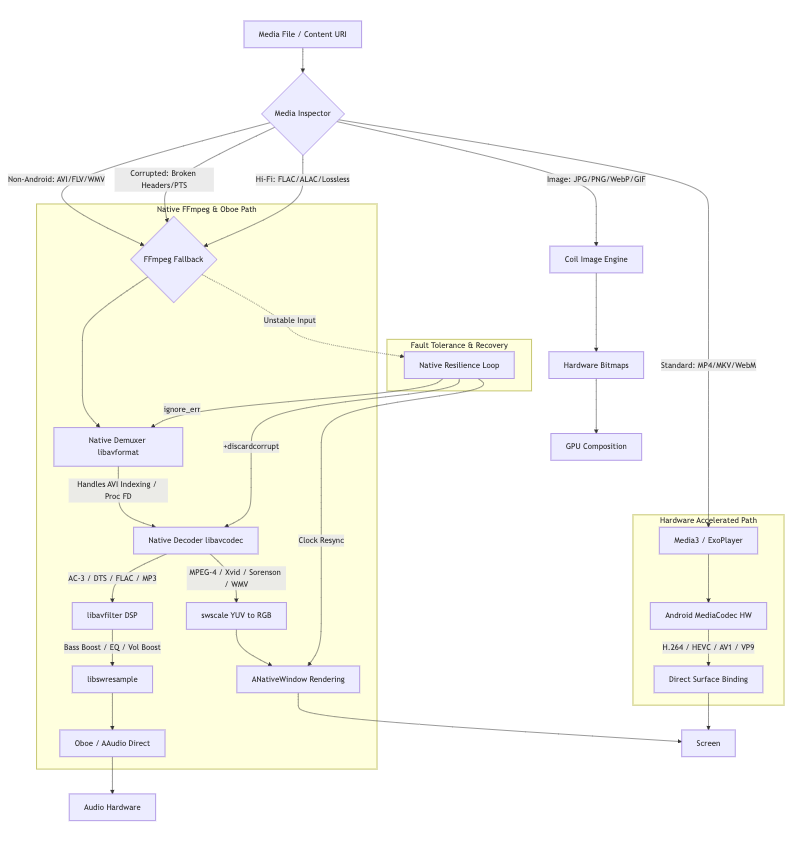
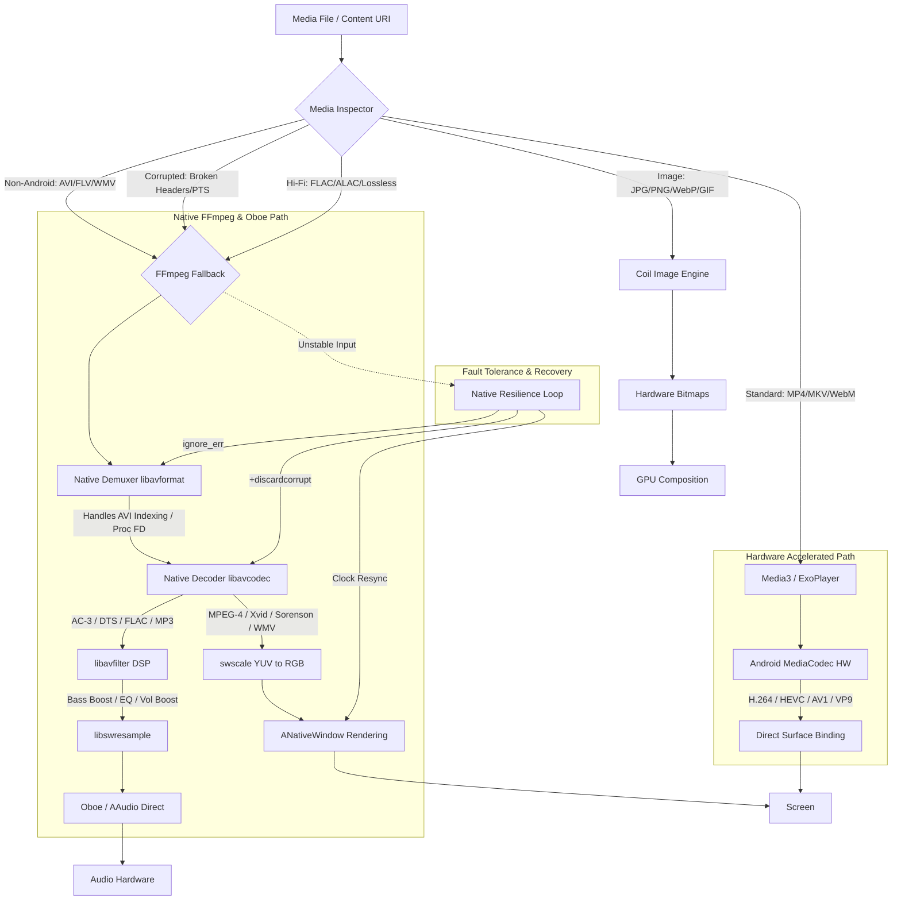

# MediaNest Architecture Overview

MediaNest is a high-performance, feature-rich media management application for Android. It is built with a **"Hardware-First"** philosophy, leveraging modern Android APIs to provide a zero-copy, privacy-focused experience.

---

## High-Level System Design

The application follows a standard modern Android architecture but with a heavily optimized media pipeline.

### Key Subsystems

1.  **UI Layer**: Built with **Jetpack Compose** and **Material 3**. It uses hardware-accelerated rendering and glassmorphic effects.
2.  **Media Engine**: A hybrid pipeline using **Android Media3 (ExoPlayer)** for standard hardware-supported formats and **Native FFmpeg** for legacy or corrupted media.
3.  **Hardware Acceleration Engine**: A proprietary subsystem that manages hardware capability detection, zero-copy rendering, and adaptive memory management.
4.  **Hybrid Image Pipeline**: Uses **Coil** for standard images and a **Gigapixel Tile Renderer** for ultra-high-resolution files (panoramas, RAW exports).
5.  **Data Layer**: Uses **Room** for metadata caching and **Jetpack DataStore** for settings. It interacts with the **Android MediaStore API** for indexing local files. See the [Local Database Schema](../../notes/reference/database-schema.md) for details.

---

## Media Flow & Routing Logic

MediaNest implements a sophisticated routing logic to ensure the best possible playback experience.

For a detailed breakdown of the routing decisions and format support, see the [Media Processing Concepts](../../notes/guides/media-processing-concepts.md).

---

## Resilience & Recovery

MediaNest is designed to handle unstable or corrupted media gracefully.

### Fault Tolerance Strategies

| Fault / Corruption Scenario | Recovery Behavior (FFmpeg Engine) |
| :--- | :--- |
| **Broken timestamps** | Monotonic clock derivation via stream time bases. Recovers without dropping playback. |
| **Corrupt video packets** | Catches `AVERROR_INVALIDDATA`, flushes decoders if required, and skips to next keyframe. |
| **Corrupt audio packets** | Skips corrupted packets and continues decoding valid frames without stopping video. |
| **A/V Desynchronization** | Audio (Oboe) and Video (NativeWindow) maintain independent loops, resyncing with the master clock. |

### Fault Tolerance & Resilience Details
- **Native Recovery**: The FFmpeg loop uses `+discardcorrupt` and `ignore_err` flags to bypass damaged frames.
- **Clock Synchronization**: The master clock is slaved to Oboe's hardware clock. If video timestamps drift by more than 500ms, a sub-millisecond resync occurs to prevent hangs.
- **Memory Safety**: Uses direct File Descriptors (`/proc/self/fd/`) to avoid memory-heavy file copying during native probing.

---

## Engine Selection Matrix (Video)

| File / Stream Condition | Preferred Path | How MediaNest Handles It |
| :--- | :--- | :--- |
| **MP4 + H.264** | **Media3 → hardware** | Evaluated clean by `MediaCapabilityInspector` → routed to `Media3PlaybackEngine`. |
| **MKV + H.265** | **Media3 → hardware** | Evaluated clean by `MediaCapabilityInspector` → routed to `Media3PlaybackEngine`. |
| **WebM + VP9** | **Media3 → hardware** | Evaluated clean by `MediaCapabilityInspector` → routed to `Media3PlaybackEngine`. |
| **AVI + Xvid** | **FFmpeg** | `MediaCapabilityInspector` forces `requiresFFmpegFallback = true` → routes to `FFmpegPlaybackEngine`. |
| **FLV + old codec** | **FFmpeg** | Probed as `FLV` container or video codec → routed to `FFmpegPlaybackEngine`. |
| **Unsupported codec** | **FFmpeg** | If Media3 fails to demux/decode, it automatically switches to `FFmpegPlaybackEngine`. |

---

## Hardware Integration Principles

1.  **Zero-Copy Pipeline**: Direct surface binding from `MediaCodec` buffers to `SurfaceView` bypasses CPU memory copies.
2.  **Gigapixel Tile Rendering**: Large images that exceed GPU texture limits (typically 4096px or 8192px) are decoded and rendered in sub-region tiles to ensure smooth zooming and panning.
3.  **Hardware First**: Priority is always given to native SoC DSPs.
4.  **DSP Audio Pipeline**: Audio effects (EQ, Volume Boost, Pitch Shift) are processed through native FFmpeg `libavfilter` chains and slaved to the Oboe hardware clock for minimal latency.
5.  **Adaptive Scaling**: RAM and VRAM caches scale dynamically based on the device's hardware tier (2GB to 64GB+).
6.  **Privacy**: 100% local processing; no cloud dependencies.

---

For deep technical details on the hardware engine, refer to the [Hardware Acceleration Specification](hardware-acceleration.md).
