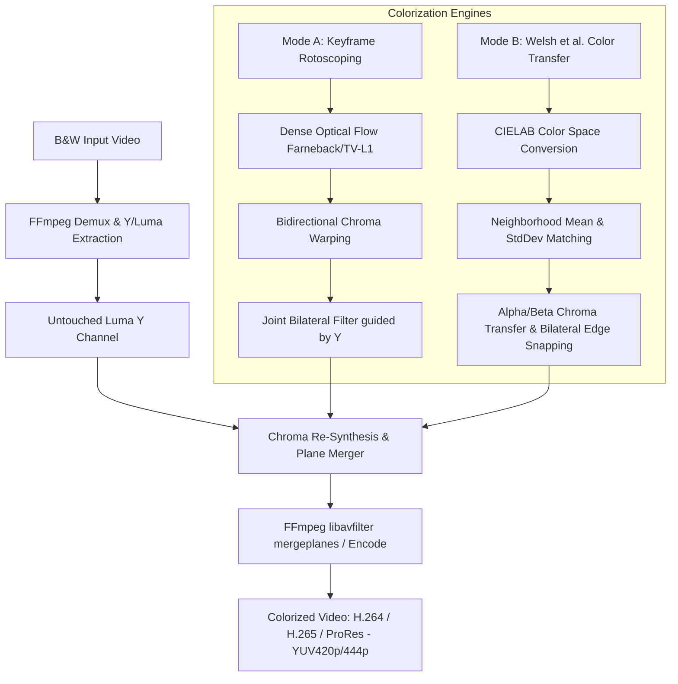

# Deterministic Non-AI Video Colorization System (Media Studio)

Implement an end-to-end, deterministic, non-neural computer vision video colorization pipeline integrated into MediaNest's Media Studio. The system colorizes black-and-white footage by isolating the original uncompressed Luminance ($Y$) plane and synthesizing the Chrominance ($U/V$ or $Cb/Cr$) channels using classic mathematical color transfer and optical flow motion estimation.

## Architecture Overview

## Core Technical Features

1. **Luminance & Chroma Separation ($YUV$ Pipeline)**:
   - Extract the grayscale video frames and preserve the exact 8-bit/10-bit Luminance ($Y$) channel without compression or blurring.
   - Synthesize only the chrominance planes ($U/V$), guaranteeing 100% sharpness and original grain preservation.

2. **Mode A: Keyframe Colorization & Dense Optical Flow Propagation**:
   - Multi-scale Farnebäck Dense Optical Flow and Dual TV-L1 non-AI motion estimation.
   - Bilinear backward warping along motion vector fields $(\Delta x, \Delta y)$ across frame intervals.
   - Bidirectional time-weighted interpolation between keyframes with motion boundary occlusion detection.
   - Edge-snapping Joint Bilateral Filter / Guided Filter using the target frame's $Y$ channel as the guide matrix to snap chroma gradients tightly to high-frequency luminance edges and prevent bleeding.

3. **Mode B: Welsh et al. Statistical Luminance Matching**:
   - Fast $RGB \leftrightarrow L\alpha\beta$ decorrelated color space conversion.
   - Spatial neighborhood luminance statistics computation ($\mu_L$, $\sigma_L$) with configurable patch sizes.
   - Best-match Euclidean feature distance search: $D = |L_t - L_r| + w_\sigma |\sigma_t - \sigma_r|$.
   - Post-transfer Joint Bilateral refinement against $Y$ channel.

4. **FFmpeg Zero-Copy Multiplexing & Encoding**:
   - `libavfilter` filter graph: `[0:v][1:v][2:v]mergeplanes=0x001020:yuv420p[out]` (or `yuv444p`).
   - Hardware-accelerated and software encoder support (H.264 `libx264`, H.265 `libx265`, Apple ProRes `prores_ks`).

5. **Media Studio UI Integration**:
   - Add `StudioTab.COLORIZE` to `MediaConverterStudio.kt`.
   - Comprehensive controls for Mode A (Keyframes, Flow iterations, Bilateral spatial/range sigmas) and Mode B (Reference palette image, sample resolution, texture weight).
   - Side-by-side split comparison preview and progress reporting.

---

## Proposed Changes

### Native Computer Vision Engine (C++)

#### [NEW] [video_colorizer.h](file:///Users/sachin/Lab/VibeCoded/medianest/app/src/main/cpp/video_colorizer.h)
- Header defining structs, interfaces, and mathematical routines for:
  - Farnebäck optical flow & bilinear warping
  - Joint Bilateral Filtering guided by $Y$ plane
  - $RGB \leftrightarrow L\alpha\beta$ conversion and Welsh et al. statistical matching
  - Chroma synthesis and planar YUV composition

#### [NEW] [video_colorizer.cpp](file:///Users/sachin/Lab/VibeCoded/medianest/app/src/main/cpp/video_colorizer.cpp)
- High-performance, multi-threaded C++ implementation of the colorization algorithms using SIMD/OpenMP-friendly loops.
- JNI bridge functions exposing:
  - `nativeProcessWelshFrame`
  - `nativeComputeOpticalFlowAndWarp`
  - `nativeJointBilateralFilter`
  - `nativeColorizeVideoPipeline`

#### [MODIFY] [CMakeLists.txt](file:///Users/sachin/Lab/VibeCoded/medianest/app/src/main/cpp/CMakeLists.txt)
- Add `video_colorizer.cpp` to the `medianest_ffmpeg` target.

---

### Kotlin Engine & Utilities

#### [NEW] [VideoColorizerEngine.kt](file:///Users/sachin/Lab/VibeCoded/medianest/app/src/main/java/com/medianest/util/VideoColorizerEngine.kt)
- High-level orchestrator managing:
  - Frame extraction via FFmpeg
  - Keyframe management and Optical Flow propagation
  - Welsh reference image matching
  - Joint Bilateral chroma filtering
  - FFmpeg `mergeplanes` multiplexing and encoding
  - Live progress StateFlow for UI feedback

#### [MODIFY] [MediaProcessorEngine.kt](file:///Users/sachin/Lab/VibeCoded/medianest/app/src/main/java/com/medianest/util/MediaProcessorEngine.kt)
- Add colorization task delegation to `VideoColorizerEngine`.

---

### Media Studio UI

#### [MODIFY] [MediaConverterStudio.kt](file:///Users/sachin/Lab/VibeCoded/medianest/app/src/main/java/com/medianest/ui/components/MediaConverterStudio.kt)
- Add `StudioTab.COLORIZE` to `StudioTab` enum.
- Add Colorizer configuration cards:
  - Mode selection (Keyframe Optical Flow vs. Welsh Reference Matching)
  - Keyframe picker / Reference image picker
  - Optical flow & bilateral filter tuning sliders
  - Output codec & pixel format selector (YUV420p, YUV444p, H.264, H.265, ProRes)
  - Live preview / progress state handling

#### [MODIFY] [AnalyticsScreen.kt](file:///Users/sachin/Lab/VibeCoded/medianest/app/src/main/java/com/medianest/ui/dashboard/AnalyticsScreen.kt)
- Update Studio quick action buttons to include Colorize if applicable.

---

## Verification Plan

### Automated Tests
- Build verification via Gradle: `./gradlew assembleDebug`
- Unit tests verifying Welsh $L\alpha\beta$ color conversion and optical flow warp accuracy.

### Manual Verification
- Test Colorize tab in Media Studio with test video and reference image.
- Verify Mode A: Keyframe propagation maintains temporal consistency without color flicker.
- Verify Mode B: Welsh color transfer correctly maps luminance to reference tones.
- Confirm zero loss of native sharpness in the original $Y$ channel.
