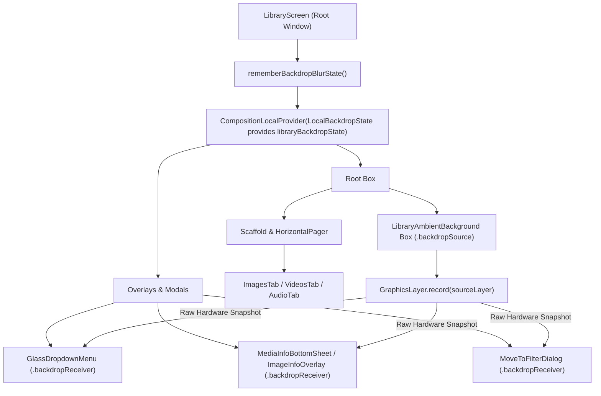
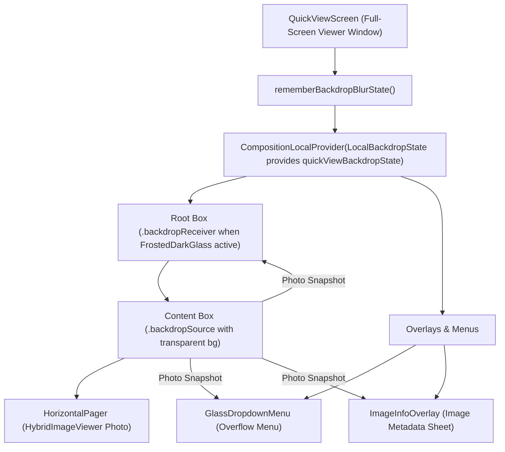

# MediaNest Hardware Backdrop Blur Architecture & Component Tree

This document provides a comprehensive technical breakdown of MediaNest's real-time, hardware-accelerated frosted glass backdrop blur engine. It details the GPU rendering pipeline, component hierarchy, coordinate translation math, and architectural guardrails.

---

## 1. Core Engineering Principles

MediaNest implements an Apple/YouTube-grade frosted glass backdrop blur engine in Jetpack Compose, built on Android's hardware `GraphicsLayer` and GPU `RenderEffect` (API 31+):

1. **Hardware Offscreen Recording**: Source content (e.g. ambient background, photo viewer, or gallery grid) records its draw operations into a single reusable `GraphicsLayer`.
2. **Synchronous Frame Signals**: Emits `drawSignal` invalidation events to force receiver surfaces to re-render synchronously during scroll, pan, and zoom gestures.
3. **Dual-Stage Optical Downsampling (8x)**: Downsamples the captured background slice by `8x` prior to Gaussian blurring.
   - Collapses high-frequency sharp text glyphs and UI borders into smooth color halos.
   - Reduces GPU VRAM and fill-rate bandwidth by **64x** (`8x8`).
4. **GPU Gaussian RenderEffect Blur**: Applies hardware `BlurEffect(radiusX = radiusPx, radiusY = radiusPx)` on Android 12+ (API 31+) or multi-pass diffuse sampling on legacy API < 31.
5. **Acrylic Frosted Glass Sheen**: Overlays a translucent theme tint (`Color.Black.copy(alpha = 0.30f)` / `Color(0x660A0C10)`) and a `0.5dp` vertical gradient glass border.

---

## 2. Backdrop Blur Pipeline Architecture

```
  ┌────────────────────────────────────────────────────────┐
  │                 Backdrop Source Content                │
  │      (LibraryAmbientBackground / HybridImageViewer)    │
  └───────────────────────────┬────────────────────────────┘
                              │
                              ▼
  ┌────────────────────────────────────────────────────────┐
  │         GraphicsLayer.record(size = srcSize)           │
  │          [Records raw unblurred screen pixels]         │
  └───────────────────────────┬────────────────────────────┘
                              │
                              ▼
  ┌────────────────────────────────────────────────────────┐
  │         CompositionLocalProvider(LocalBackdropState)   │
  │          [Propagates BackdropBlurState down tree]      │
  └───────────────────────────┬────────────────────────────┘
                              │
                              ├───────────────────────────────┐
                              ▼                               ▼
  ┌───────────────────────────────────────┐ ┌───────────────────────────────────┐
  │     Backdrop Receiver Surface A       │ │    Backdrop Receiver Surface B    │
  │    (GlassDropdownMenu / File Info)    │ │      (MoveToFilterDialog / etc)   │
  └───────────────────┬───────────────────┘ └─────────────────┬─────────────────┘
                      │                                       │
                      ▼                                       ▼
  ┌─────────────────────────────────────────────────────────────────────────────┐
  │  Stage 1: Translate (-offset/8) + Downsample (1/8x)                         │
  │  Stage 2: GPU RenderEffect Blur (BlurEffect / Diffuse Fallback)             │
  │  Stage 3: ClipRect (receiverSize) & Render                                  │
  │  Stage 4: Draw Translucent Acrylic Tint (0x660A0C10 / 30% Black)            │
  │  Stage 5: Draw 0.5dp Gradient Glass Border                                  │
  └─────────────────────────────────────────────────────────────────────────────┘
```

---

## 3. Detailed Component Hierarchy & Blur Trees

### 3.1 Library Screen Blur Tree



### 3.2 QuickViewScreen (Full-Screen Photo Viewer) Blur Tree



---

## 4. Mathematical Coordinate Translation in Stage 1

To ensure that the glass card crops and blurs **only the exact area of the screen directly behind it**:

1. **Relative Offset Calculation**:
   $$\text{offset.x} = \text{receiverPos.x} - \text{sourcePos.x}$$
   $$\text{offset.y} = \text{receiverPos.y} - \text{sourcePos.y}$$

2. **Downsample Matrix Transformation**:
   When downsampling by $\text{factor} = 8$:
   ```kotlin
   downsampleLayer.record(size = downsampledSize) {
       translate(left = -offset.x / factor, top = -offset.y / factor) {
           scale(scaleX = 1f / factor, scaleY = 1f / factor, pivot = Offset.Zero) {
               drawLayer(sourceLayer)
           }
       }
   }
   ```
3. **Correct Matrix Order**:
   - `translate` is applied **outside** `scale(1/factor)`.
   - A pixel at $(X, Y)$ in `sourceLayer` translates to:
     $$X' = \frac{X - \text{offset.x}}{\text{factor}}$$
   - At $X = \text{offset.x}$ (the left edge of the glass card), $X' = 0$.
   - The cropped region matches the card's on-screen bounding box with **100% sub-pixel accuracy**.

---

## 5. Surface Component Comparison

| Feature / Property | `GlassSurface` | `BackdropGlassSurface` | `AmbientGlassSurface` |
| :--- | :--- | :--- | :--- |
| **Primary File** | [`GlassSurface.kt`](file:///Users/sachin/Lab/VibeCoded/medianest/app/src/main/java/com/medianest/ui/components/GlassSurface.kt) | [`BackdropGlassSurface.kt`](file:///Users/sachin/Lab/VibeCoded/medianest/app/src/main/java/com/medianest/ui/components/BackdropGlassSurface.kt) | [`AmbientGlassSurface.kt`](file:///Users/sachin/Lab/VibeCoded/medianest/app/src/main/java/com/medianest/ui/components/AmbientGlassSurface.kt) |
| **Primary Role** | Grid cards (`MediaGridItem`), Song rows, Album cards, Player panels. | Overlays, Dialogs (`RenameFileDialog`, `MoveToFilterDialog`), Dropdown menus (`GlassDropdownMenu`), Sheets (`MediaInfoBottomSheet`). | Audio player screen, Playlist cards, ID3 Tag Editor. |
| **Backdrop Blur** | Conditional (`enableBlur = true`). Defaults to `false` for 120fps scrolling. | Natively connected to `LocalBackdropState` (`enableBlur = true` default). | No hardware backdrop receiver (uses local image blur + radial orbs). |
| **Image Loader Overhead** | Supports `backgroundImage` (`Uri` / Drawable). | **0 Image Loader Overhead** (No Coil / image loading code). | 64dp blurred artwork layer at `alpha = 0.32f`. |
| **Default Tint** | `Color(0x221C1F2B)` (13% Dark Slate Glass). | `Color(0x330F1015)` (20% Obsidian) / `Color.Black.copy(alpha = 0.30f)`. | Base `#0C0E14` + extracted artwork `hue` radial glow orbs. |

---

## 6. Architectural Rules & Guardrails

1. **Avoid Recursive RenderNode Draw Loops**:
   - `.backdropSource(state)` **must not wrap** any composable child that calls `.backdropReceiver(state)` on the same `BackdropBlurState`.
   - Drawing a `GraphicsLayer` inside its own recording pass causes a recursive GPU draw loop (`RenderNode A` drawing `RenderNode A`), freezing or crashing the process.

2. **Isolate `backdropSource` to Background Surfaces**:
   - Attach `.backdropSource` to background layers (`LibraryAmbientBackground` or photo viewer `HorizontalPager`).
   - Keep floating menus, dialogs, and sheets outside the `backdropSource` container.

3. **Explicit `backdropState` Passing for Modals**:
   - Always pass `backdropState = state` down to dialogs and bottom sheets to ensure `backdropReceiver` receives a non-null state instance directly.

4. **Keep `enableBlur = false` on Scrollable Grid Items**:
   - List and grid items (`SongsList`, `AlbumsGrid`, `MediaGridItem`) should keep `enableBlur = false` (default) to maintain 120fps fluid scrolling without triggering GPU offscreen recording during fast scroll passes.
